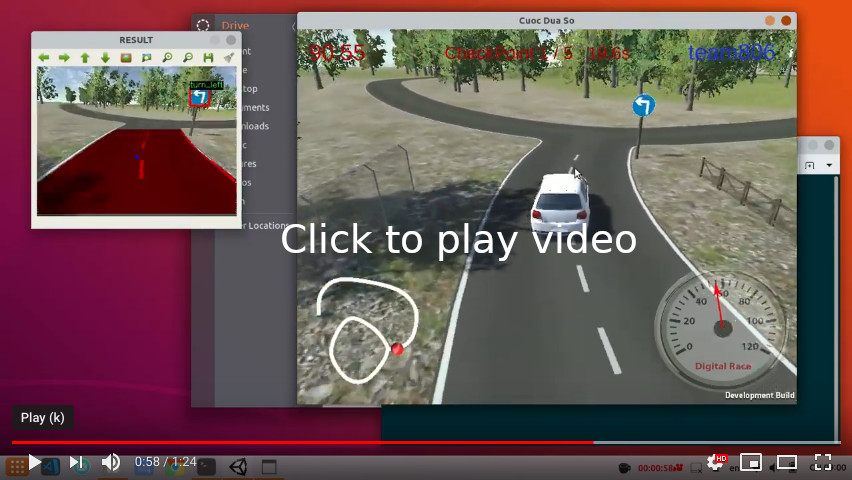

# ICT60 RACECAR - TEAM806

## DEMO

## ALGORITHMS
- For road segmentation, we use mainly floodfill and watershed algorithm. As you can see in the video, these algorithms do well in road segmentation and also noise removal.

- For traffic sign detection, we detect the interested area using color segmentation (HSV color space) and then pass the result into a SVM (Support Vector Machine) classfier with HOG (Histogram of oriented gradients) features.

## ENVIRONMENT REQUIREMENT

- UBUNTU 18.04 / 16.04
- OPENCV 3.4.3: https://aicurious.io/posts/2018-09-14-cai-dat-opencv-tren-ubuntu-18-04/
- NPM: https://www.npmjs.com/
- ROS:
    + For Ubuntu 18.04: ROS Melodic Morenia: http://wiki.ros.org/melodic/Installation/Ubuntu
    + For Ubuntu 16.04: ROS Lunar: http://wiki.ros.org/lunar/Installation/Ubuntu
- unzip: `sudo apt-get install unzip`
- curl: `sudo apt-get install curl`

## INSTALL

- **Step 1:** Ensure you have installed all the environment requirement
- **Step 2:** Clone the source code repository
- **Step 3:** Initialize the workspace by the command:
~~~
npm run init-workspace
~~~
- **Step 4:** Add this line to ~/.bashrc file to active the main workspace by default (or you have to run it each time you open a new tab).
~~~
source <path-to-repo-folder>/main_ws/devel/setup.bash
~~~
- **Step 5:** Download data files
    + Download svm file for Traffic Sign Detector 2 (optional): `npm run download-svm-file-trafficsign-detector-2`
    + Download all simulators (maybe large): `npm run download-all-simulators`
    + Download simulator 4 only: `npm run download-simulator4`
    + Download simulator 3 only: `npm run download-simulator4`
    + Download simulator 2 only: `npm run download-simulator4`
    + Download simulator 1 only: `npm run download-simulator4`

## RUN THE PROJECT

### Normal run

Following are the steps of a normal run

- **Step 1: Start ROS server:** Open a new terminal tab and type:
~~~
npm run ros-server
~~~
- **Step 2: Re-Build the source code:**
~~~
npm run make
~~~
- **Step 3: Run ROS server:** Open a new terminal tab and type:
~~~
npm run ros-server
~~~
- **Step 4: Run Racecar node** Open a new terminal tab and type:
~~~
npm run racecar
~~~
- **Step 5: Run Simulator:** Open a new terminal tab and type:
~~~
npm run simulator4
~~~
You can change the simulator (4) with a value (1-4) to start other simulator versions.

After that enter the configuration into simulator and run it. The value of `Team` for simulator is `team806`.

### RUNNING COMMANDS

- `npm run init-workspace` : Initialize the workspace
- `npm run ros-server`: Start ROS server
- `npm run make`: Build the project
- `npm run make-debug`: Build the project with debug info
- `npm run racecar`: Run the racecar node
- `npm run racecar-debug`: Run the racecar node with debug info
- `npm run racecar-launch`: Run the racecar node using launch file
- `npm run simulator1`: Run simulator v1
- `npm run simulator2`: Run simulator v2
- `npm run simulator3`: Run simulator v3
- `npm run simulator4`: Run simulator v4
- `npm run image_viewer`: Run image viewer (for debuging)

